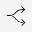
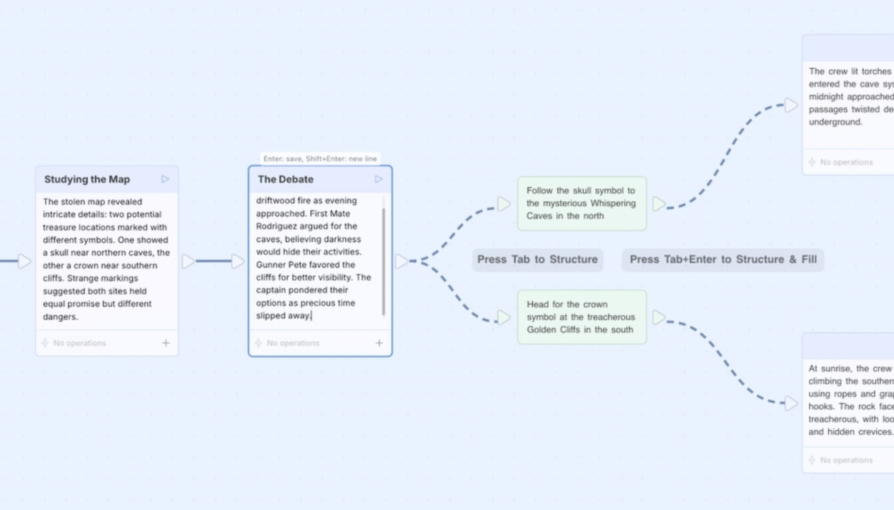
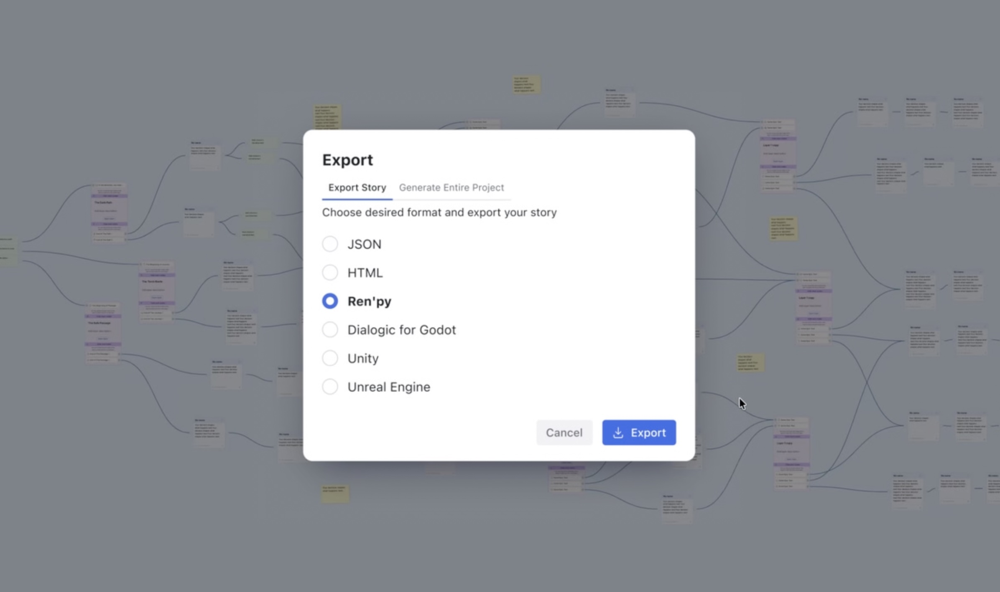

<div align="center">



# Go Flow

**Open-source platform for interactive storytelling**

Build branching narratives, visual novels, and dialogue systems on an infinite canvas.

[](LICENSE)
[](https://github.com/goflowspace/goflow)
[](https://discord.gg/goflow)
[](https://github.com/goflowspace/goflow/wiki)

[Website](https://goflow.space) | [Documentation](https://github.com/goflowspace/goflow/wiki) | [Discord](https://discord.gg/goflow) | [Telegram](https://t.me/goflowspace)

</div>

<br/>

<div align="center">
  
</div>

<br/>

## Features

<table>
<tr>
<td width="50%">

### Visual Story Editor
Build complex, non-linear narratives using a node-based editor on an infinite canvas. Connect scenes, add branching choices, and see your entire story structure at a glance.

</td>
<td width="50%">

### Export Anywhere
Export to JSON, HTML, Ren'Py, Dialogic (Godot), Unity, or Unreal Engine. Go from story to playable experience without manual data transfer.

</td>
</tr>
<tr>
<td width="50%">

### Entities & Knowledge Base
Manage characters, locations, items, and lore in a built-in knowledge base. Keep your story world consistent as it grows.

</td>
<td width="50%">

### Localization
Translate your stories into multiple languages with built-in localization support. Reach a global audience without leaving the editor.

</td>
</tr>
</table>

<div align="center">
  
</div>

## How Go Flow Compares

Go Flow combines visual editing, a knowledge base, and game engine integration in one open-source tool.

| | Go Flow | Twine | Ren'Py | ink | Yarn Spinner |
|---|:---:|:---:|:---:|:---:|:---:|
| Visual node editor | Yes | Yes | — | — | — |
| No coding required | Yes | Yes | — | — | — |
| Built-in knowledge base | Yes | — | — | — | — |
| Game engine export | Yes | — | Yes* | Yes | Yes |
| Self-hosted / open source | Yes | Yes | Yes | Yes | Yes |
| Web-based | Yes | Yes | — | — | — |

<sub>* Ren'Py is itself an engine. "—" means the feature is not built-in (may be available via plugins or workarounds).</sub>

## Quick Start

### Prerequisites

- [Docker](https://docs.docker.com/get-docker/) (v20+)
- [Docker Compose](https://docs.docker.com/compose/install/) (v2+)

### Run

```bash
git clone https://github.com/goflowspace/goflow.git
cd goflow
./start.sh
```

The app will be available at:
- **Frontend:** http://localhost:3000
- **Backend API:** http://localhost:3001

On first run, a default user is created automatically. Check the backend logs for credentials:

```bash
docker compose logs backend
```

### Stop

```bash
./stop.sh
```

## Configuration

Copy the example config and customize as needed:

```bash
cp .env.example .env
```

Key settings in `.env`:

| Variable | Default | Description |
|----------|---------|-------------|
| `DATABASE_URL` | `mongodb://mongodb:27017/goflow?replicaSet=rs0&directConnection=true` | MongoDB connection string |
| `FRONTEND_URL` | `http://localhost:3000` | Frontend URL (for CORS) |
| `NEXT_PUBLIC_API_URL` | `http://localhost:3001` | Backend API URL |
| `OSS_USER_PASSWORD` | auto-generated | Initial user password |
| `OPENAI_API_KEY` | — | Optional: enables AI features (OpenAI) |
| `ANTHROPIC_API_KEY` | — | Optional: enables AI features (Anthropic) |

## Architecture

```
goflow/
├── app/          # Frontend — Next.js 15, React 19, TypeScript
├── backend/      # Backend — Express, TypeScript, Prisma, MongoDB
├── docker-compose.yml
├── start.sh
└── stop.sh
```

### Tech Stack

- **Frontend:** Next.js 15, React 19, Tailwind CSS, Zustand, Socket.IO
- **Backend:** Express, TypeScript, Prisma ORM, MongoDB 7.0
- **Real-time:** WebSocket (Socket.IO)
- **Infrastructure:** Docker Compose

## Development

### Local development (without Docker)

**Backend:**

```bash
cd backend
npm install
cp .env.example .env.development  # configure DATABASE_URL
npm run dev
```

**Frontend:**

```bash
cd app
npm install
npm run dev
```

## Contributing

We welcome contributions! Whether it's bug reports, feature requests, or pull requests — every bit helps.

1. Fork the repository
2. Create your feature branch (`git checkout -b feature/amazing-feature`)
3. Commit your changes
4. Push to the branch and open a Pull Request

See our [Wiki](https://github.com/goflowspace/goflow/wiki) for more details.

## Roadmap

We're actively developing the OSS edition. Here's what's coming next:

- [ ] **AI features for OSS** — enable AI co-authoring with public providers (OpenAI, Anthropic, Google) and local models (Ollama, LM Studio) ([#5](https://github.com/goflowspace/goflow/issues/5))
- [ ] **AI localization** — verify and fix AI-powered translation of story content ([#6](https://github.com/goflowspace/goflow/issues/6))

Have an idea? [Open an issue](https://github.com/goflowspace/goflow/issues/new) or join the discussion in our community channels.

## Community

- [Discord](https://discord.gg/goflow) — chat with the team and other creators
- [Telegram Channel](https://t.me/goflowspace) — news and updates
- [Telegram Community](https://t.me/flow_community_chat) — community chat
- [GitHub Issues](https://github.com/goflowspace/goflow/issues) — bug reports and feature requests

## License

This project is licensed under the [GNU Affero General Public License v3.0](LICENSE).

You can freely use, modify, and distribute this software. If you run a modified version on a server and let others interact with it, you must make the source code of your modified version available to them.
